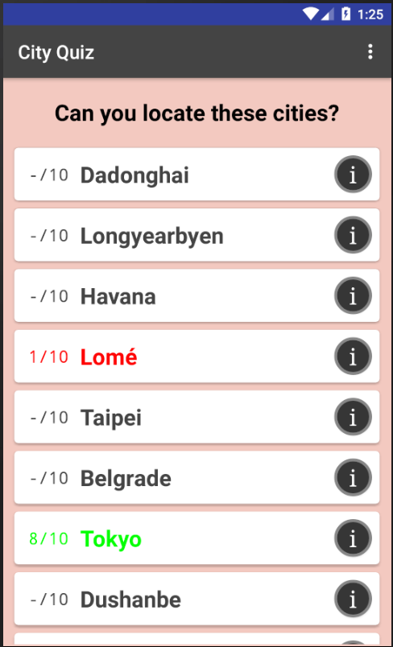
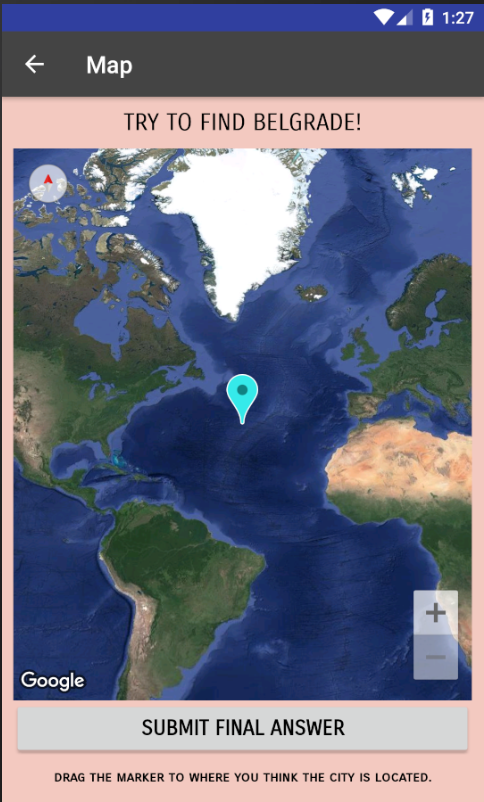
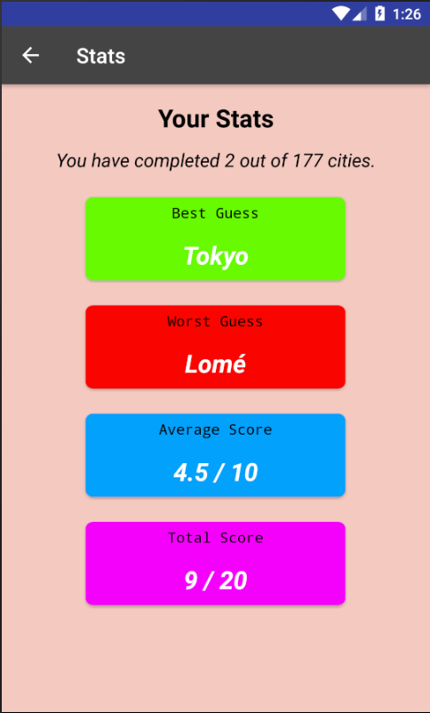

# City Quiz

*Android application that quizzes knowledge of where cities are on a map.*

#### Features:
- Over 170 cities around the world to try to locate on a map.
- Tracks your stats.
- Easily reset the game at any time.
- Sort questions by score received.
- Long click on a city to hear how it's pronounced.
- Click the 'i' next to a city to learn more about it.

#### Technology Used:
- **Google Maps API** leveraging the satellite map and pin to answer questions.
- **Room Persistence Library** for storing data locally and making queries on the data.
- **Implicit and Explicit Intents** to launch activities like the map and stats page as well as allowing users to visit the city's Wikipedia page.
- **Async Tasks** to do data fetching and database operations.
- **Recycler View** to store the various cities.

### Screenshots:

